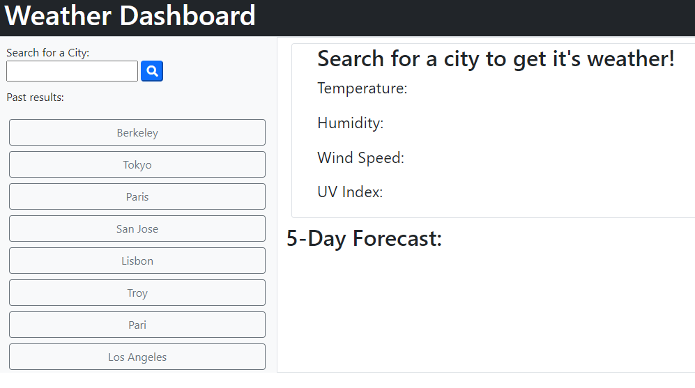
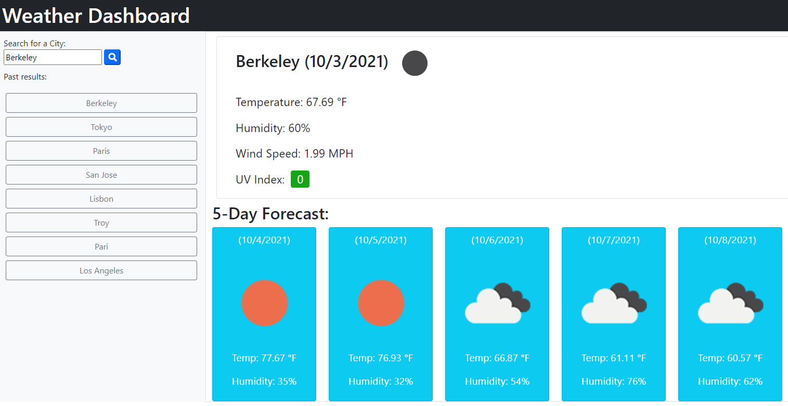
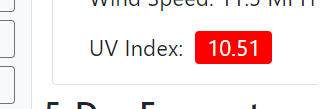

# Weather Dashboard

This project uses server-side APIs to get the latest up-to-date weather in any city around the world. The user can search for a city and see the current temperature, humidity, wind speed and UV index along with a 5 day forecast. This search along with previous searches show up in the sidebar. These past searches persist between page reload (max 15).

## Getting Started

Enter a VALID city name to get the weather in that city

## Deployed Link

* [See Live Site](https://emdorgan.github.io/weather-planner/)

## Screenshots

## Built With

* [HTML](https://developer.mozilla.org/en-US/docs/Web/HTML)
* [CSS](https://developer.mozilla.org/en-US/docs/Web/CSS)
* [Javascript](https://developer.mozilla.org/en-US/docs/Web/JavaScript)
* [Bootstrap](https://getbootstrap.com/)
* [jQuery](https://jquery.com/)

## Authors

* **Emily Dorgan** 

- [Link to Portfolio Site](https://emdorgan.github.io/portfolio/)
- [Link to Github](https://github.com/emdorgan)
- [Link to LinkedIn](https://www.linkedin.com/in/emily-dorgan/)